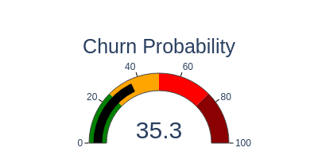

# Survival Analysis and Churn Prediction
This repository presents an analytical project focused on predicting customer churn using the powerful framework of **Survival Analysis (Time-to-Event Analysis)**, complemented by a robust **Random Forest Regression** model and state-of-the-art **Explainable AI (XAI) using SHAP values**.

The project goes beyond standard binary classification, aiming to predict when a customer is likely to churn, and providing clear explanations for individual predictions.

🌟 **Project Goals**

The primary objectives of this project are:

1. Time-to-Event Prediction: Model the time until the churn event using Survival Analysis (Kaplan-Meier, Cox Proportional Hazards).

2. Regression Baseline: Develop a high-performing non-linear baseline model, Random Forest Regression, to predict customer churn probability.

3. Explainable AI (XAI): Utilize SHAP values to interpret the complex model decisions, revealing the local and global feature importance for churn prediction.

4. Identify Key Churn Drivers: Determine which customer and service features significantly influence customer retention and predicted lifespan.

5. Evaluate & Compare: Assess the performance and interpretability of both the statistical (Survival) and Machine Learning (Random Forest) approaches.

🔬 **Methodology & Modeling**

1. Survival Analysis Models (Time-to-Event)
- This approach models the expected duration until the churn event, accounting for censoring (customers who haven't churned yet).

- Kaplan-Meier Estimator: Non-parametric estimation and visualization of the Survival Function (the probability a customer will not churn up to a certain time t).

- Cox Proportional Hazards (CPH) Model: Estimates the Hazard Ratio (HR) for predictors, quantifying how a feature increases or decreases the instantaneous risk of churning.

2. Random Forest Regression (Tenure Prediction)
- This serves as a predictive machine learning baseline, treating the customer Tenure (duration) as the target variable to be predicted.

- Model: Random Forest Regressor, capable of capturing non-linear interactions between features.

- Target Variable: Churn (Yes/No).

3. Explainable AI (SHAP)
- SHAP (SHapley Additive exPlanations) is used to interpret the predictions made by the complex Random Forest model.

- Local Interpretability: SHAP values explain why the model made a specific prediction for an individual customer (e.g., this customer has high predicted tenure because of their low service usage and long subscription length).

- Global Interpretability: SHAP summary plots provide a global view of feature importance and the direction of their effect on the predicted tenure.

🖼️ **Key Visualization: Churn Gauge**

A critical output of this project is the visualization of the predicted churn risk, often presented for immediate business interpretation.

The file churn_gauge.png provides an example of how the model's prediction

<p align="center">
  
</p>

📂 **Repository Structure**  

The project is organized into modular components for data, code, and analysis.

| Directory/File       | Description                                                                                                                                   |
|---------------------|-----------------------------------------------------------------------------------------------------------------------------------------------|
| `data/`             | Contains the datasets.                                                                                                                        |
| `notebooks/`        | Jupyter Notebooks containing the entire end-to-end analysis, including EDA, model training, SHAP analysis, and model comparison.              |
| `preprocessing.py`  | Python module with reusable functions for data cleaning, feature engineering, and preparing the data for both Survival and Regression models. |
| `plots_model.py`    | Python module with helper functions for generating key visualizations (Confusion Matrix, ROC curve, Feature importance and coefficients).     |
| `churn_gauge.png`   | A sample visualization illustrating churn propability (/churn risk).                                                                          |


🚀 **Getting Started**

Follow these steps to set up and run the analysis locally.

**Prerequisites**

You need Python 3.7+ installed.

**Installation**

1. Clone the repository:

```
git clone https://github.com/glorymary96/Survival-Analysis-and-Churn-Prediction.git
cd Survival-Analysis-and-Churn-Prediction
```

2. Install dependencies
```
pip install requirements.txt
```

**Running the Analysis**

1. Launch Jupyter:
```
jupyter notebook
```

2. Navigate to the `notebooks` folder and open the main analysis notebook to execute the code step-by-step. The notebook will walk through 
    - Exploratory Data Analysis (`01_EDA.ipynb`) 
    - Survival modeling (`02_Survival_analysis.ipynb`)
    - Survival Regression (`03_Survival_Regression.ipynb`)
    - Random Forest Regression (`04_Churn_Prediction_Model.ipynb`)
    - SHAP interpretation (`05_XAI_explanation.ipynb`)

